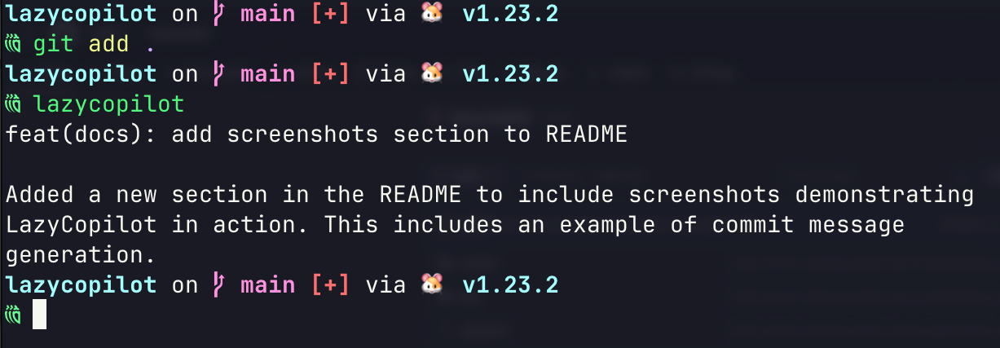

# LazyCopilot

LazyCopilot is a versatile AI-powered tool designed to assist developers with various tasks, starting with generating better commit messages. It leverages the capabilities of GitHub Copilot to provide intelligent suggestions based on your code changes.

[](https://github.com/mr687/lazycopilot/releases)
[](https://goreportcard.com/report/github.com/mr687/lazycopilot)
[](https://github.com/mr687/lazycopilot/releases/latest)
[](https://github.com/Homebrew/homebrew-core/blob/master/Formula/lazycopilot.rb)

## Features

- **Smart Commit Message Generation**: 
  - Automatically generates commit messages following conventional formats
  - Supports multiple commit message styles (normal, funny, wise, trolling)
  - Option to generate title-only commits
  - Preview generated messages without committing
- **Flexible Git Integration**:
  - Works with staged changes
  - Optional automatic staging of unstaged changes
  - Custom repository path support
- **Style Management**:
  - List available commit message styles
  - Add custom commit message styles
  - Remove existing styles
  - Sync styles with defaults
- **GitHub Authentication**:
  - Secure device flow authentication
  - Easy login/logout management
  - Token persistence

## Installation

### From Source

1. Clone the repository:
    ```sh
    git clone https://github.com/mr687/lazycopilot.git
    cd lazycopilot
    ```

2. Build the project:
    ```sh
    make build
    ```
3. Run
    ```sh
    ./bin/lazycopilot
    ```

### Using Homebrew

1. Add the tap:
    ```sh
    brew tap mr687/lazycopilot
    ```

2. Install LazyCopilot:
    ```sh
    brew install lazycopilot
    ```

### Using Scoop (Windows)

1. Add the bucket:
    ```sh
    scoop bucket add lazycopilot https://github.com/mr687/scoop-lazycopilot
    ```

2. Install LazyCopilot:
    ```sh
    scoop install lazycopilot
    ```

### Binary Release

Binary releases are available for macOS, Linux, and Windows architectures.

1. Download the binary release file from the [releases page](https://github.com/mr687/lazycopilot/releases).
2. Extract the downloaded file.
3. Move the binary to a directory included in your system's PATH.

## Usage

To use LazyCopilot, run the following command in your terminal:

```sh
lazycopilot
```

### Commands

#### `commit`

Generate and manage commit messages using AI.

```sh
# Generate commit message
lazycopilot commit gen [flags]

# List available styles
lazycopilot commit styles

# Add custom style
lazycopilot commit style-add <name> <description> <prompt>

# Remove a style
lazycopilot commit style-remove <name>

# Sync styles with defaults
lazycopilot commit style-sync
```

Commit Generation Flags:
- `--path, -p`: Specify repository path (default: current directory)
- `--stage, -s`: Stage all changes if no staged changes detected
- `--title-only, -t`: Generate only the commit title
- `--style, -S`: Specify commit style (normal, funny, wise, trolling)
- `--no-commit, -n`: Preview message without committing

#### `auth`

Manage GitHub authentication for Copilot access.

```sh
lazycopilot auth login   # Authenticate with GitHub
lazycopilot auth logout  # Remove local authentication
```

## Future Plans

LazyCopilot aims to evolve into a comprehensive AI assistant for developers. Future features may include:

- **Code Review Assistance**: Provide AI-driven code review suggestions.
- **Documentation Generation**: Automatically generate documentation based on code comments and structure.
- **Bug Detection**: Identify potential bugs and suggest fixes.
- **Code Refactoring**: Offer intelligent code refactoring suggestions.

## Screenshots

Here are some screenshots demonstrating LazyCopilot in action:

### Commit Message Generation



## Contributing

Contributions are welcome! Please read the [CONTRIBUTING.md](CONTRIBUTING.md) for guidelines on how to contribute to this project.

## License

This project is licensed under the MIT License. See the [LICENSE](LICENSE) file for details.
